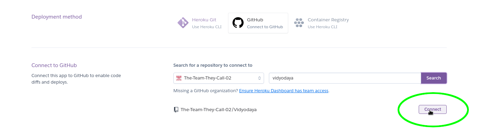

# Team-02: Vidyodaya

<!-- markdown-toc start - Don't edit this section. Run M-x markdown-toc-refresh-toc -->

**Table of Contents**

- [Team-02: Vidyodaya](#team-02-vidyodaya)
  - [Deployment Status](#deployment-status)
    - [Front end:](#front-end)
  - [Check out the live site!](#check-out-the-live-site)
  - [About Vidyodaya](#about-vidyodaya)
  - [What We Are Building: Front End](#what-we-are-building-front-end)
  - [What We Are Building: Back End](#what-we-are-building-back-end)
  - [How We Built It](#how-we-built-it)
  - [Challenges We Ran Into](#challenges-we-ran-into)
  - [Accomplishments We Are Proud Of](#accomplishments-we-are-proud-of)
  - [Our Members](#our-members)
  - [How We Addressed Each Of The Judging Criteria:](#how-we-addressed-each-of-the-judging-criteria)
    - [CSV / FILE UPLOAD-DOWNLOAD](#csv--file-upload-download)
    - [PROBLEM STATEMENT](#problem-statement)
    - [DOCUMENTATION](#documentation)
    - [SECURITY](#security)
    - [POLISH](#polish)
- [Front end Deployment Instructions (Heroku)](#front-end-deployment-instructions-heroku)
  - [Creating the app](#creating-the-app)
  - [Setting up the build](#setting-up-the-build)
  - [Setting up continuous integration](#setting-up-continuous-integration)

<!-- markdown-toc end -->

## Deployment Status

### Front end:

[](https://app.netlify.com/sites/vidyodaya/deploys)

## Check out the live site!

https://vidyodaya.netlify.app/

## About Vidyodaya

Vidyodaya's mission is to improve the quality of education received by
underprivileged children in Adivasi communities and to establish a
culturally appropriate learning system with active participation of
the community.

Our task is to create a website for Vidyodaya that is more appealing
and user-friendly for new visitors.

Requested Features:

- Modernize the current website
- Make the website more kid-friendly, yet contains tribal elements
- Improve the navigation to various web pages
- Create a login for admins, and allow new admins to be created
- Allow admins to add reports and articles to the site
- Create a contact form

## What We Are Building: Front End

We created an initial design in Figma which you can experience by
clicking on the image below.

[](https://www.figma.com/file/8FMdNta6L6CoZy0Z44XeZz/Vidyodaya-Website-Redesign?node-id=1%3A64)

## What We Are Building: Back End

Below you can see our database table layout for the back end.


## How We Built It

The front end solution for **Vidyodaya** includes:

- HTML
- CSS
- JavaScript
- React
- Context
- Styled Components

The back end solution for **Vidyodaya** includes:

- Java
- Spring
- PostgresSQL
- OAuth 2.0
- Cloudinary

The project for **Vidyodaya** is hosted on:

- Netlify for the front end
- Heroku for the database

## Challenges We Ran Into

Initially we started out working on the Zuri's Circle project which we
thought was a Website project. When we understood that it was supposed
to be an Mobile App we looked for solutions to build it with our
current skill sets. Ultimately we determined we were not currently up
to the challenge of picking up new languages so quickly, and we ended
up changing to the Vidyodaya project. This left us with only 4 days to
complete the project instead of the original 7 days.

## Accomplishments We Are Proud Of

We are extremely proud of our communication skills and quick work,
considering how little time we had to pull this together. Our entire
team was excellent to work with.

## Our Members

Some of our team members had to leave mid-week, and other members
replaced them so that is why you will see more than the maximum of 5
team members.

- [Christian Bautista](https://www.linkedin.com/in/christianbautista/) - Leader
  and Design Extraordinaire / Front End, Design, Client Relations
- [Emily Adams](https://www.linkedin.com/in/emilyadamsprofile/) - Lady
  of Documentation / Front End, Back End, Database Design
- [Marlon Del Rosario](https://www.linkedin.com/in/mpaolodr/) -
  Styling & Form Powerhouse / Front End
- [Harry Henry Gebel](https://www.linkedin.com/in/harryhenrygebel/) -
  Back End Sorcerer / Back End
- [Julliann Dulay](https://www.linkedin.com/in/jullianndulay/) - Data
  Table Maniac / Back End
- [Emily Gauthier](https://www.linkedin.com/in/emily-gauthier-7013/) -
  Front End Queen / Front End

## How We Addressed Each Of The Judging Criteria:

### CSV / FILE UPLOAD-DOWNLOAD

NGOs can easily download information about their volunteers in a CSV
format which will be updated by the volunteer form on the
website. There currently is no need for any other information to be
downloaded, but it would be simple to add.

### PROBLEM STATEMENT

Our task was to create a website for Vidyodaya that is more appealing
and user-friendly for new visitors. Their current website has many
buried tabs and it is difficult for users to find what they are
looking for. We modernized the current website and made it more
kid-friendly, yet containing tribal elements that the NGO requested.

### DOCUMENTATION

Since we paired down how many pages existed on the site, and improved
the navigation to various web pages, this made it easy for both the
admins and the visitors to find what they are looking for. In
addition we prepared back end documentation for any future programmers
working on this website.

### SECURITY

We created a secure login for admins using OAuth2, and the ability for
new admins to be created.

Only Admins have the ability to add and remove files from the site.

### POLISH

The NGO could use this site as their own starting today. The back end
is currently deployed with Heroku and the front end is deployed on
Netlify. The main features of the site are fully functional.

Some features we would still want to add are:

1. News Letter sign up
2. Chat Feature (to have more active engagement with visitors of the site)
3. Visitor Login
4. Donor Dashboard (so admins can track their interactions and
   donations, and send updates to those whom they have helped.)
5. Volunteer Dashboard (so volunteers can see progress, future
   activities, current tasks, and comprehensive detail for their role
   as a volunteer.)
6. For this website to be a progressive web app that will help the NGO
   manage and interact with people within and outside the
   organization.
7. A form to add Committee members to the committee page
8. Password recovery for admins
9. A fully mobile responsive website

# Front end Deployment Instructions (Heroku)

These instructions will create a Heroku deployment for the front end, linked
to a GitHub repository and set to automatically deploy commits to main. They
require the Heroku CLI to be installed. In examples, replace examples names
and keys with actual names and keys as necessary.

## Creating the app

First, create the app, set it to use the most current stack, and set the
OAuth2 environment variables.

```sh
heroku create vidyodaya
heroku stack:set heroku-20 -a vidyodaya
heroku config:set REACT_APP_CLIENT=sample-client -a vidyodaya
heroku config:set REACT_APP_SECRET=sample-secret -a vidyodaya
```

## Setting up the build

The standard Heroku pipeline doesn't work with our repository for
automatic deployments from GitHub because it contains multiple
projects in subdirectories, so we use Alexey Timanovsky's excellent
`subdir-heroku-buildpack` which makes deploying from a subdirectory
almost painless. Because Heroku cannot detect the type of a project in
a subdirectory, we also explicitly set the build type to a buildpack
specifically designed to handle apps create with create-react-app, and
we set the exact directory that contains the front end project.

```sh
heroku buildpacks:set https://github.com/timanovsky/subdir-heroku-buildpack -a vidyodaya
heroku buildpacks:add mars/create-react-app -a vidyodaya

```

## Setting up continuous integration

Next, we set up continuous integration with Heroku. This can only be
done from the Heroku web interface. Some of these steps may have
already been completed if you have previously connected Heroku to a
GitHub repository.

Log into Heroku and select your project, the go to the `Deploy` tab and click on `Connect to GitHub` in the `Connect to GitHub section.


On the GitHub authorization screen that comes up, authorize Heroku's
access, being sure to grant access to your organization if necessary.

Under `Connect to GitHub`, type in the repository name and, if
necessary, select your organization. Press the search button and then
click on the `Connect` button that comes up. If the connect button
does not come up or if it shows up for the wrong repository, make sure
you have selected the correct organization and typed the name
correctly in the `Search` area.



Make sure you have `main` (or whichever branch you want to
automatically deploy from) selected on the deployment menu that
appears (blue circle). Click on `Enable Automatic Deploys` (green
circle). Heroku will now automatically redeploy whenever changes are
pushed to the selected branch. Finally, click on `Deploy Branch` (red
circle) to make the initial deployment.


<!--  LocalWords:  subdir heroku vidyodaya nodejs Zuri's
 -->
